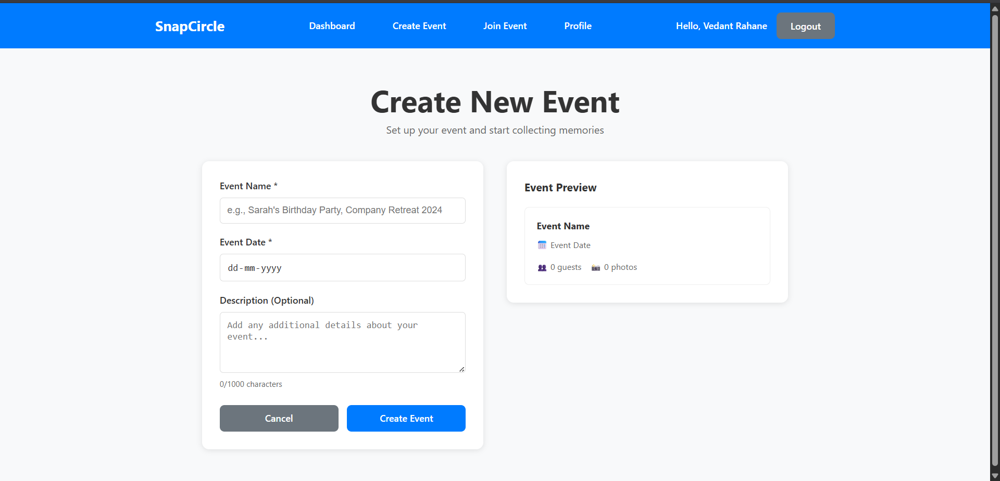

# SnapCircle - Event Photo Sharing App

A comprehensive web application for sharing and managing photos at events. Users can create events, invite guests via QR codes or links, upload photos, and manage their event galleries with role-based access control.

## ✨ Features

- **Secure Auth & Profiles:** Register/login, manage profile, upload selfie for face recognition.
- **Event Management:** Create, view, and delete events. Dashboard for owned/joined events.
- **Guest Invitations:** Invite via QR code or link. Guests join with code/QR and selfie.
- **Photo Gallery:** Upload/view/delete event photos. Only members can access event photos.
- **Face Recognition:** Detects faces in photos, personalizes galleries for each user.
- **Role-Based Access:** Owners manage events/guests/photos; guests upload/view/leave.
- **QR Code Integration:** Generate/scan QR codes for quick event joining.
- **Privacy:** Face data stored securely as embeddings, removable by user.

## 🛠️ Technologies Used

**Frontend:**
- React (Vite)
- React Router
- Context API (for Auth)
- Axios

**Backend:**
- FastAPI
- SQLAlchemy (ORM)
- Alembic (migrations)
- PostgreSQL
- JWT (authentication)
- Face Recognition (Python library)
- boto3 (AWS S3 integration)

## 📸 Screenshots

### Dashboard


### Create Event Page


### Join Event Page


### Organizer Event Page


### Guest Event Page


## 🚀 Quick Start

1. **Clone the repository**

   ```bash
   git clone <repository-url>
   cd SnapCircleV1
   ```

2. **Set up the backend**

   ```bash
   cd backend
   python -m venv venv
   source venv\Scripts\activate  
   pip install -r requirements.txt
   cp .env.example .env
   uvicorn main:app --reload
   ```

3. **Set up the frontend**

   ```bash
   cd frontend
   npm install
   npm run dev
   ```
